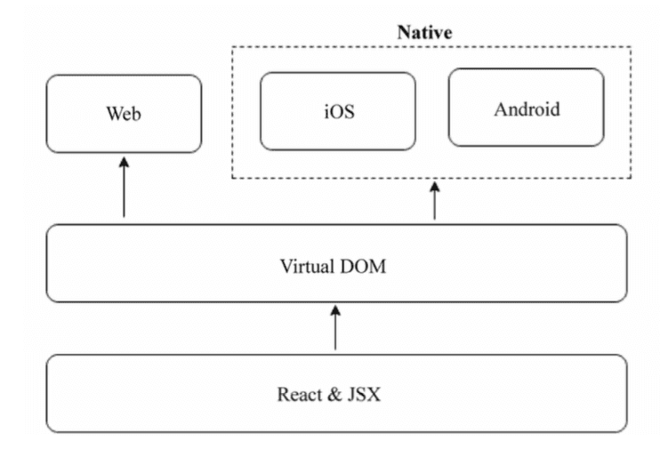

## 安装 React Native

> Note: Mac 环境

```bash
brew install watchman
brew install flow
## 全局安装 react-native-cli
npm install -g react-native-cli
```

## 创建 react-native 项目

```bash
$ react-native init Hello

...

To run your app on iOS:
   cd /Users/theone/theone/phone_app/Hello
   react-native run-ios
   - or -
   Open ios/Hello.xcodeproj in Xcode
   Hit the Run button
To run your app on Android:
   cd /Users/theone/theone/phone_app/Hello
   Have an Android emulator running (quickest way to get started), or a device connected
   react-native run-android
```

到此已创建好了项目

执行启动命令后, 可以看见虚拟器上显示的内容.

## React Native 简介

React Native 的目标是高效跨平台开发 Native 应用,同时也强调了 "一次学习, 多个平台编写代码".
也就是说, React Natie 不是 "一次编码,多处引用".



- - -
